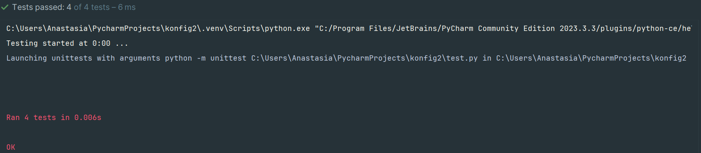

## Общее описание

Проект **Dependency Visualizer** предоставляет функциональность для генерации диаграмм зависимостей с использованием **PlantUML**. Он позволяет визуализировать структуры пакетов и их зависимости, а также предоставляет средства для сохранения диаграмм в файлы, которые можно использовать в документации или других целях.

Основные функции:
- Генерация PlantUML-скриптов для визуализации зависимостей пакетов.
- Сохранение скриптов в файлы с расширением `.puml`.
- Генерация графиков на основе созданных скриптов через **PlantUML**.
- Возможность настройки путей, имени пакета и других параметров через конфигурационный файл **TOML**.

## Описание всех функций и настроек

### 1. **load_config(path)**

Загружает конфигурацию из указанного пути. Ожидается, что файл конфигурации будет в формате TOML. Функция возвращает словарь с параметрами.

**Параметры**:
- `path` (str): Путь к конфигурационному файлу.

**Возвращает**:
- Словарь с параметрами конфигурации.

---

### 2. **generate_complex_plantuml_script(package_name, num_levels, max_dependencies_per_level)**

Генерирует сложный PlantUML-скрипт для визуализации зависимостей с заданным количеством уровней и максимальным количеством зависимостей на уровне.

**Параметры**:
- `package_name` (str): Название пакета, для которого создаются зависимости.
- `num_levels` (int): Количество уровней зависимостей.
- `max_dependencies_per_level` (int): Максимальное количество зависимостей на уровне.

**Возвращает**:
- Строку, содержащую PlantUML-скрипт.

---

### 3. **save_plantuml_script(script, script_path)**

Сохраняет PlantUML-скрипт в файл.

**Параметры**:
- `script` (str): PlantUML-скрипт.
- `script_path` (str): Путь к файлу, в который нужно сохранить скрипт.

**Возвращает**:
- None.

---

### 4. **generate_graph(plantuml_path, script_path, output_image_path)**

Генерирует график зависимостей с использованием **PlantUML**. Функция запускает команду для генерации изображения.

**Параметры**:
- `plantuml_path` (str): Путь к файлу **PlantUML** (например, `plantuml.jar`).
- `script_path` (str): Путь к PlantUML-скрипту.
- `output_image_path` (str): Путь для сохранения сгенерированного изображения.

**Возвращает**:
- None.

---

## Описание команд для сборки проекта

Для установки и сборки проекта следуйте этим шагам:

1. Клонируйте репозиторий:

   ```bash
   git clone https://github.com/yourusername/dependency-visualizer.git
   cd dependency-visualizer
    ```
2. Установите зависимости:
```bash
pip install -r requirements.txt
 ```
3. Убедитесь, что у вас установлен PlantUML. Вы можете скачать его здесь https://plantuml.com/ru/
4. Для запуска проекта используйте следующую команду:
```bash
python main.py
 ```
Скрипт сгенерирует файл generate_img.puml и создаст изображение графика зависимостей в указанной папке.

## Примеры использования
### Пример генерации и сохранения диаграммы зависимостей

1. Сначала создайте конфигурационный файл config.toml:
```toml
visualizer_path = "/path/to/plantuml.jar"
package_name = "SamplePackage"
output_path = "/path/to/output/directory"

 ```
2. Затем запустите скрипт:
```bash
python main.py
 ```
Это создаст файл generate_img.puml и сгенерирует изображение зависимостей.

Пример визуализации: 

## Результаты прогона тестов
Для запуска тестов используйте команду:
```bash
python -m unittest test.py
 ```
Пример вывода после успешного прохождения тестов:


### Примечания:
Все тесты проходят успешно, включая проверку загрузки конфигурации, генерации скриптов и графиков, а также работы с subprocess для создания изображений.

В тестах используется mocking для проверки вызовов функций без фактического взаимодействия с файловой системой или внешними программами.

